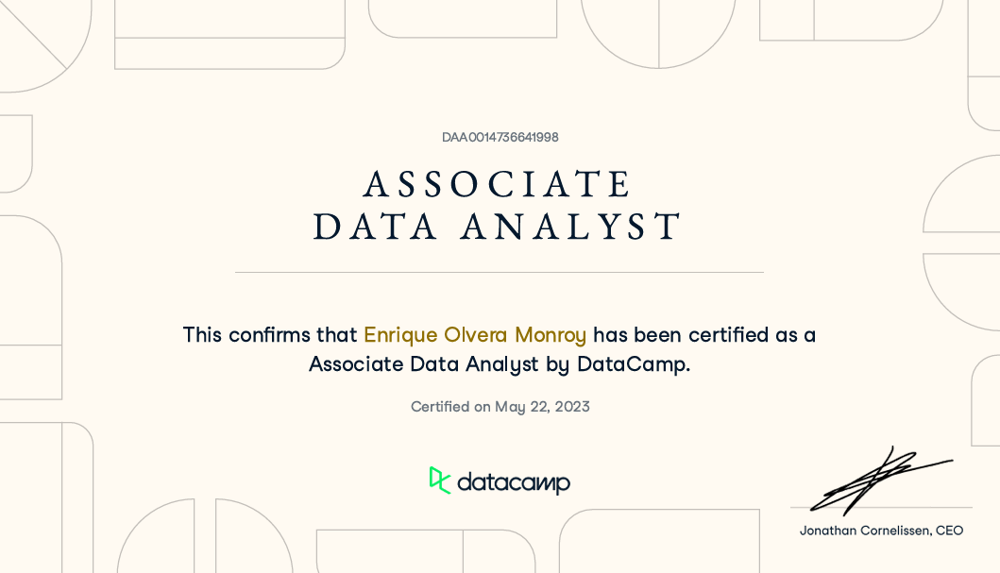

# 📊 DataCamp Certification: Associate Data Analyst

This repository contains the Jupyter Notebook I used to complete the **DataCamp Associate Data Analyst Certification** (ID: `DAA0014736641998`), officially obtained on **May 22, 2023** by **Enrique Olvera Monroy**.

## 🧠 About the Certification

The Associate Data Analyst certification by [DataCamp](https://www.datacamp.com) evaluates core data analysis competencies, including:

- Data manipulation and wrangling using `pandas`
- Exploratory data analysis and visualization with `matplotlib` and `seaborn`
- Interpreting insights from datasets to inform business decisions

## 📓 About the Jupyter Notebook

The notebook in this repo showcases my practical skills in:

- Importing and cleaning datasets
- Creating insightful visualizations
- Applying descriptive statistics
- Drawing data-driven conclusions

This work represents a real-time project completed under assessment conditions, demonstrating my readiness for entry-level roles in data analytics.

## 📎 Files Included

- `Certification - DAA0014736641998.pdf`: Official certification from DataCamp
- `Data Camp Certification Test (Associate Data Analyst).ipynb`: My submitted Jupyter Notebook

