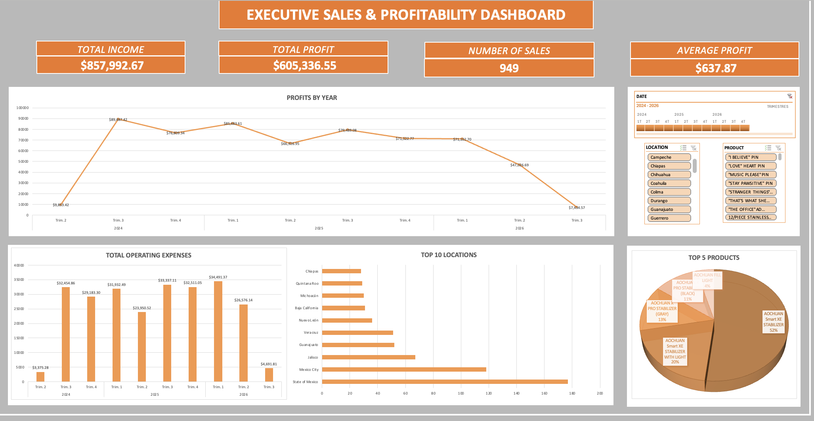

# Executive Sales & Profitability Dashboard

An interactive Excel dashboard that consolidates sales, cost, and profitability data into a single executive view, built with native Excel tools (Pivot Tables, Pivot Charts, and Slicers)

## Overview

This dashboard analyzes **949 sales transactions** across Mexican states and product categories, tracking income, profit, operating expenses, and product mix over an 11-quarter period (Q2 2024 – Q3 2026). It's designed to answer the questions a business owner or sales manager would ask at a glance: *How much are we making? Where is it coming from? What's it costing us? What's selling?*

## Key Metrics (KPI Cards)

| Metric | Value |
|---|---|
| Total Income | $857,992.67 |
| Total Profit | $605,336.55 |
| Number of Sales | 949 |
| Average Profit per Sale | $637.87 |

## Dashboard Components

- **Profits by Year** — Trend line of total profit by quarter, segmented by year, to spot seasonality and growth/decline patterns.
- **Total Operating Expenses** — Quarterly bar chart of commissions, taxes (ISR), VAT (IVA), and shipping costs combined.
- **Top 10 Locations** — Horizontal bar ranking of Mexican states by sales volume.
- **Top 5 Products** — Pie chart showing product mix concentration (product category share of total sales).
- **Slicers** — Interactive filters for Date (year/quarter), Location, and Product, allowing the whole dashboard to be filtered dynamically.

## Data Model

The workbook contains three sheets:

1. **`Sales Data`** — the transactional source table (949 rows), with the following fields:
   - `DATE`, `CUSTOMER ID`, `PRODUCT`, `LOCATION`
   - `ACCOUNT INCOME`, `SALES COMMISSION`, `SUBTOTAL`
   - `INCOME TAX (ISR)`, `VAT (IVA)`, `SHIPPING`, `TOTAL PROFIT`
2. **`Analysis`** — Pivot Tables calculating the KPIs and time-series aggregations that feed the dashboard.
3. **`Dashboard`** — the visual, presentation-ready layer combining Pivot Charts, KPI cards, and slicers.

## Tools & Techniques Used

- Excel Pivot Tables & Pivot Charts
- Slicers for interactive, cross-filtered reporting
- KPI summary cards driven by Pivot Table aggregations
- Custom formatting and layout for an executive-ready, single-page dashboard