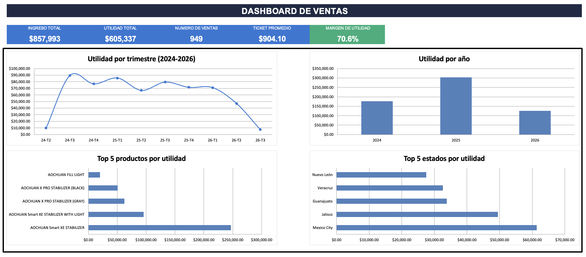

# 📊 Dashboard de Ventas en Excel

Dashboard interactivo construido en Excel para analizar el desempeño de ventas de un negocio: ingresos, utilidad, márgenes, evolución en el tiempo, productos top y estados top.

## 📁 Contenido del repositorio

| Archivo | Descripción |
|---|---|
| `Business_Dashboard_SP.xlsx` | Libro de Excel con los datos crudos, los cálculos y el dashboard visual |
| `Dashboard_SP.png` | Captura de pantalla del dashboard final |
| `README.md` | Este documento |

## 🎯 Objetivo del proyecto

Transformar un registro transaccional de ventas (fecha, cliente, producto, ubicación, comisiones, impuestos, envío) en un tablero ejecutivo que responda, de un vistazo, preguntas de negocio como:

- ¿Cuánto se vendió y cuánto se ganó en total?
- ¿Cómo evoluciona la utilidad por trimestre y por año?
- ¿Qué productos y qué estados generan más utilidad?
- ¿Cuál es el margen real del negocio una vez descontados comisión, ISR, IVA y envío?

## 🗂️ Estructura del libro de Excel

El archivo tiene tres hojas, cada una con un propósito distinto:

**1. `Ventas`** — Base de datos transaccional (949 registros, columnas A–M): fecha, ID de cliente, producto, ubicación (estado), ingreso, comisión de venta, subtotal, ISR, IVA, envío, utilidad total, año y trimestre.

**2. `Análisis`** 
- KPIs principales (ingreso, utilidad, número de ventas, ticket promedio, margen)
- Utilidad por año, con crecimiento año contra año
- Utilidad por trimestre (24-T2 a 26-T3)
- Utilidad por producto y por estado, ordenada de mayor a menor

**3. `Dashboard`** — Hoja de presentación: tarjetas de KPIs y 4 gráficos nativos de Excel enlazados a la hoja `Análisis`.

## 📈 KPIs principales

| KPI | Valor |
|---|---|
| Ingreso total | $857,993 |
| Utilidad total | $605,337 |
| Número de ventas | 949 |
| Ticket promedio | $904.10 |

## 🔍 Hallazgos principales

- **Crecimiento 2024 → 2025:** la utilidad creció **+72.4%** ($176,150 → $303,622).
- **2026 muestra una caída (-58.6%)** frente a 2025, pero corresponde a un **año con datos parciales** (hasta el último trimestre registrado, 26-T3), no a una caída real de negocio.
- **Producto líder:** *AOCHUAN Smart XE Stabilizer* concentra el **40.8%** de toda la utilidad, seguido de su variante *WITH LIGHT* (15.8%).
- **Concentración de catálogo:** los 2 productos top ya explican más de la mitad (56.6%) de la utilidad total, señal de alta dependencia de pocos SKUs.
- **Estados líderes en utilidad:** Ciudad de México, Jalisco y Guanajuato encabezan el top 5 estatal.

> 💡 Nota: al ser fórmulas dinámicas, si se agregan nuevas filas a `Ventas` (ampliando el rango o convirtiéndolo en tabla) todo el dashboard se actualiza automáticamente.

## ⚠️ Nota sobre los datos

Los identificadores de cliente (`Customer 1`, `Customer 2`...) están anonimizados. 