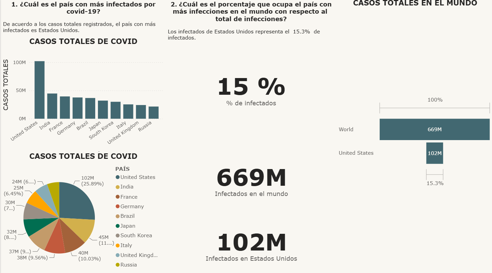
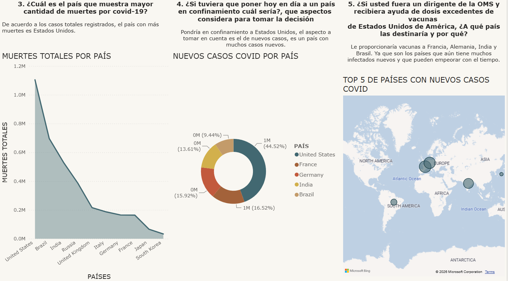

# 📊 Dashboard COVID-19 | Power BI

Dashboard interactivo desarrollado en **Power BI** que analiza la evolución global de la pandemia de COVID-19, con foco en casos totales, muertes, nuevos contagios y una propuesta de toma de decisiones basada en los datos.

## 🎯 Objetivo del proyecto

El objetivo fue construir un dashboard que responda, con datos, a preguntas clave sobre el impacto del COVID-19 a nivel mundial y permita simular la perspectiva de un tomador de decisiones (por ejemplo, un dirigente de la OMS) frente a la información disponible.

## ❓ Preguntas que responde el dashboard

1. ¿Cuál es el país con más infectados por COVID-19?
2. ¿Qué porcentaje ocupa el país con más infecciones respecto al total mundial?
3. ¿Cuál es el país con mayor cantidad de muertes por COVID-19?
4. ¿A qué país se pondría hoy en confinamiento y bajo qué criterio?
5. Si fueras un dirigente de la OMS con dosis excedentes de vacunas de Estados Unidos, ¿a qué países las destinarías y por qué?

## 🔎 Principales hallazgos

- **Estados Unidos** es el país con más casos totales acumulados (102M), representando el **15.3%** de los 669M de infectados en el mundo.
- **Estados Unidos** también encabeza la lista de muertes totales, seguido de Brasil e India.
- Los países con más nuevos casos activos son Estados Unidos, Alemania y Francia, lo que orientaría una medida de confinamiento hacia ese grupo.
- Ante un excedente de vacunas, los países prioritarios serían Francia, Alemania, India y Brasil, por concentrar la mayor cantidad de nuevos contagios.

## 🛠️ Herramientas utilizadas

- **Power BI Desktop** — modelado de datos, visualizaciones y diseño del dashboard
- **Excel (.xlsx)** — fuente de datos original

## 🗂️ Fuente de datos

El dataset utilizado corresponde a datos históricos de COVID-19 a nivel mundial (basado en Our World in Data), con **más de 252,000 registros** y **248 países/regiones**, incluyendo variables como:

- Casos totales y nuevos casos por país y fecha
- Muertes totales y nuevas muertes
- Datos demográficos y socioeconómicos (densidad poblacional, edad mediana, PIB per cápita, expectativa de vida, camas hospitalarias, etc.)
- Indicadores de vacunación
