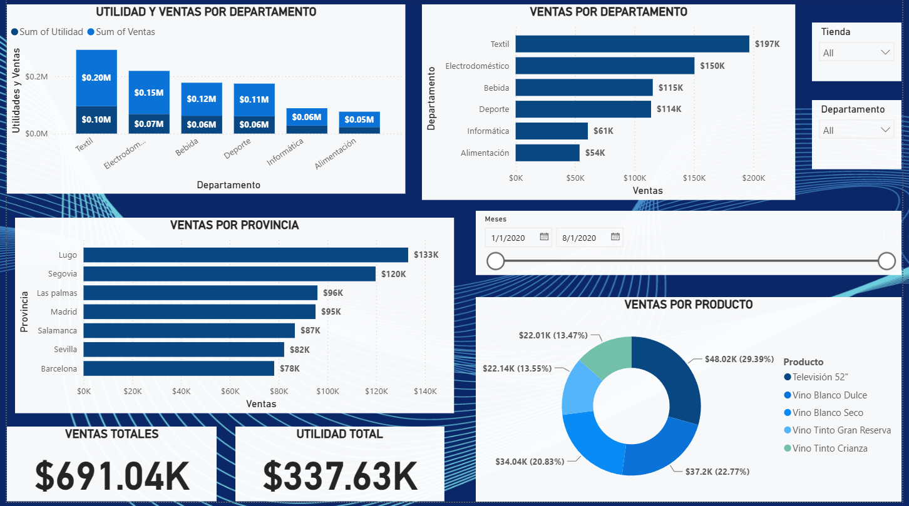

# 📊 Dashboard de Ventas en España — Power BI

Dashboard interactivo desarrollado en **Power BI** para el análisis de ventas y utilidades de una cadena de tiendas en España, con desglose por departamento, provincia, producto y periodo de tiempo.

---

## 🎯 Objetivo del proyecto

Analizar el comportamiento de las ventas y la rentabilidad de la compañía durante el periodo **enero–agosto 2020**, identificando qué departamentos, provincias y productos concentran los mejores resultados, con el fin de apoyar la toma de decisiones comerciales.

---

## 🗂️ Descripción de los datos

El archivo `Ventas_Espana.xlsx` contiene el detalle transaccional utilizado como fuente del dashboard:

| Campo | Descripción |
|---|---|
| `Meses` | Fecha del registro (mensual) |
| `Producto` | Nombre del producto vendido |
| `Provincia` | Provincia de España donde se realizó la venta |
| `Tienda` | Tienda física asociada a la venta |
| `Departamento` | Categoría del producto (Textil, Electrodoméstico, Bebida, Deporte, Informática, Alimentación) |
| `Ventas` | Monto de ventas ($) |
| `Beneficio` | Utilidad generada ($) |

**Resumen del dataset:**
- 130 registros
- Periodo: enero 2020 – agosto 2020
- 7 provincias, 6 tiendas, 6 departamentos y 20 productos distintos

---

## 🛠️ Herramientas utilizadas

- **Power BI Desktop** — construcción del modelo de datos y del dashboard
- **Excel (.xlsx)** — fuente de datos original
- DAX / medidas para el cálculo de KPIs (Ventas Totales, Utilidad Total)

---

## 📈 Visualizaciones incluidas

El dashboard cuenta con los siguientes elementos:

- **Utilidad y Ventas por Departamento** — comparativo de barras con doble medida (utilidad vs. ventas)
- **Ventas por Departamento** — ranking horizontal de los 6 departamentos
- **Ventas por Provincia** — ranking horizontal de las 7 provincias
- **Ventas por Producto** — gráfico de dona con la participación por producto
- **Tarjetas KPI** — Ventas Totales ($691.04K) y Utilidad Total ($337.63K)
- **Segmentadores (slicers)** — por Tienda, Departamento y rango de Meses (línea de tiempo interactiva)

---

## 🔍 Principales hallazgos

- **Textil** es el departamento con mayores ventas ($197K), seguido de **Electrodoméstico** ($150K).
- **Lugo** es la provincia con mayor volumen de ventas ($133K), por encima incluso de Madrid ($95K) y Barcelona ($78K).
- El margen de utilidad global del negocio es de aproximadamente **48.9%** ($337.63K de utilidad sobre $691.04K en ventas).
- El producto **Televisión 52"** concentra la mayor participación individual dentro del top de productos analizado (29.39%).