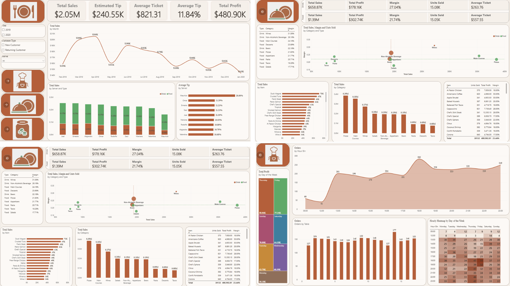
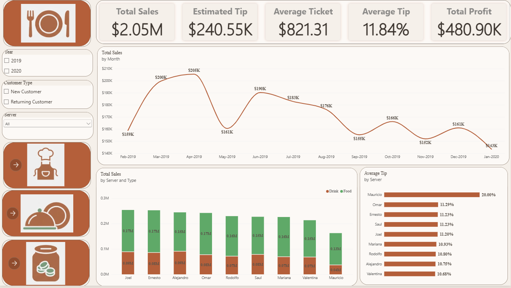
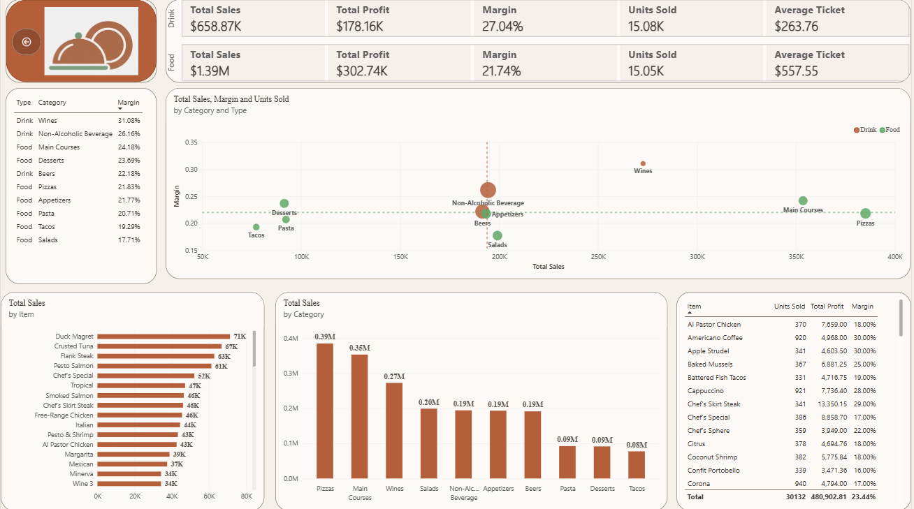
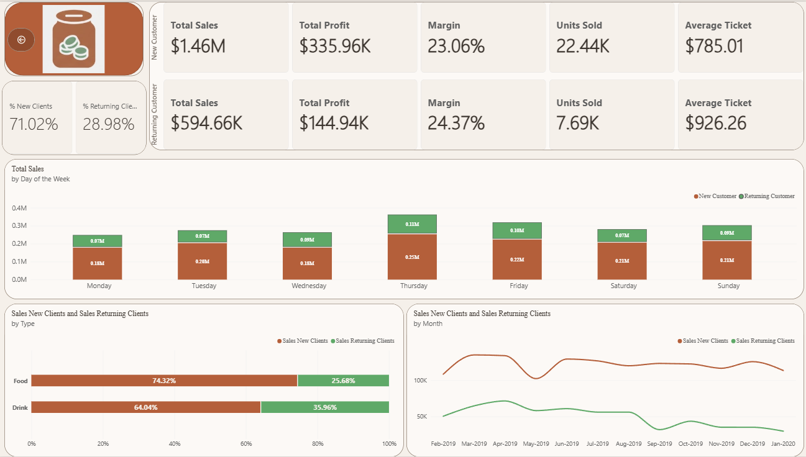
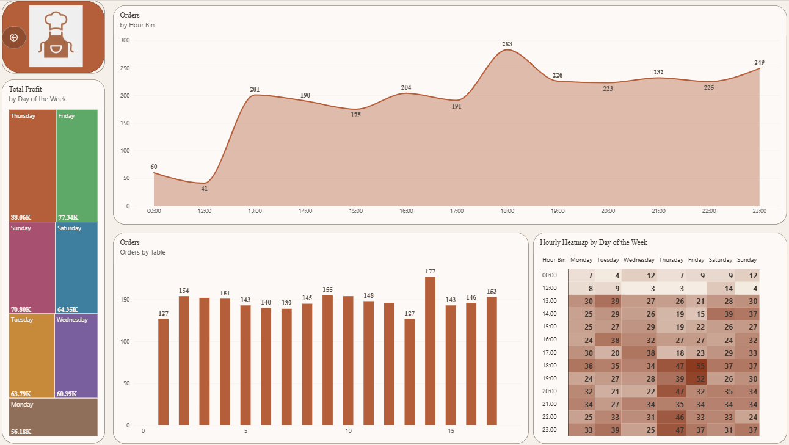
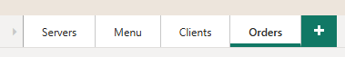

# 🍽️ Restaurant Performance Dashboard — Power BI

An interactive Power BI dashboard analyzing sales, profitability, staff performance, menu profitability, customer behavior, and order patterns for a restaurant business across 2019–2020.

---

## 📌 Project Overview

This project simulates a real-world business intelligence solution for a restaurant, designed to help management make data-driven decisions around **sales performance, menu strategy, customer retention, and operational efficiency**.

The dashboard is built entirely in **Power BI** and organized into **4 interconnected pages**, each focused on a different business dimension:

| Page | Focus |
|------|-------|
| **Servers** | Overall sales performance and server/waiter productivity |
| **Menu** | Product/category profitability and best-selling items |
| **Clients** | New vs. returning customer behavior and value |
| **Orders** | Order volume, peak hours, and table utilization |

---

## 🎯 Business Questions Answered

- What is the overall sales and profit performance, and how has it trended month over month?
- Which servers generate the most sales and the highest tips?
- Which menu categories and items are the most profitable (not just the best-selling)?
- What share of revenue comes from new vs. returning customers, and how does their spending behavior differ?
- When are the busiest hours and days of the week, and how is table demand distributed?

---

## 📊 Page 1 — Servers (Overview)

**KPIs:** Total Sales ($2.05M) · Estimated Tip ($240.55K) · Average Ticket ($821.31) · Average Tip (11.84%) · Total Profit ($480.90K)

- **Total Sales by Month** — line chart tracking monthly sales from Feb 2019 to Jan 2020, highlighting seasonal peaks and dips.
- **Total Sales by Server and Type** — stacked bar chart breaking down each server's sales into Food vs. Drink.
- **Average Tip by Server** — ranked bar chart identifying top-performing servers by tip percentage.
- **Filters:** Year, Customer Type (New/Returning), and Server — enabling dynamic drill-down across the entire report.

---

## 🍕 Page 2 — Menu

**KPIs (split by Drink / Food):** Total Sales, Total Profit, Margin, Units Sold, Average Ticket for each category group.

- **Category margin table** ranking every menu category (Wines, Non-Alcoholic Beverages, Main Courses, Desserts, Beers, Pizzas, etc.) by profit margin.
- **Total Sales, Margin and Units Sold by Category and Type** — bubble/scatter chart plotting sales vs. margin, with bubble size representing units sold, to quickly spot high-volume/low-margin vs. low-volume/high-margin categories.
- **Total Sales by Item** — horizontal bar ranking of the top 20 individual dishes/drinks by revenue.
- **Total Sales by Category** — bar chart comparing category-level revenue.
- **Item-level detail table** with Units Sold, Total Profit, and Margin for granular analysis.

---

## 👥 Page 3 — Clients

**KPIs (split by New / Returning customers):** Total Sales, Total Profit, Margin, Units Sold, Average Ticket, plus % New Clients (71.02%) vs. % Returning Clients (28.98%).

- **Total Sales by Day of the Week** — stacked bar showing New vs. Returning customer sales per weekday (Thursday stands out as the peak day).
- **Sales by Type (Food/Drink) split by customer segment** — highlighting that returning customers convert to drink purchases at a higher rate.
- **Sales trend by Month** for New vs. Returning customers, showing that new customer acquisition drives the majority of revenue and seasonal swings.

---

## ⏱️ Page 4 — Orders

- **Total Profit by Day of the Week** — treemap-style breakdown, with Thursday and Friday generating the highest profit.
- **Orders by Hour Bin** — area chart revealing a lunch bump and a strong dinner peak around 18:00.
- **Orders by Table** — bar chart showing demand distribution across individual tables to support seating/staffing decisions.
- **Hourly Heatmap by Day of the Week** — a conditional-formatted matrix pinpointing the exact hour/day combinations with the highest order volume (useful for staff scheduling).

---

## 🛠️ Tools & Techniques

- **Power BI Desktop** — data modeling, DAX measures, and report design

## 🧭 Navigation

The report uses custom icon-based buttons for intuitive navigation between the 4 pages:

`Servers → Menu → Clients → Orders`

---

## 🔑 Key Insights

- **New customers drive volume, returning customers drive value** — returning customers have a higher average ticket ($926 vs. $785) despite representing only ~29% of clients.
- **Food outsells Drinks 2:1**, but **Drinks carry a higher margin** (27.0% vs. 21.7%), suggesting an opportunity to upsell beverages.
- **Thursday and Friday** are the strongest days for both profit and order volume, with a clear dinner rush around **18:00**.
- **Server performance varies significantly** in tip percentage (10.7%–20.0%), which could inform training or incentive programs.
