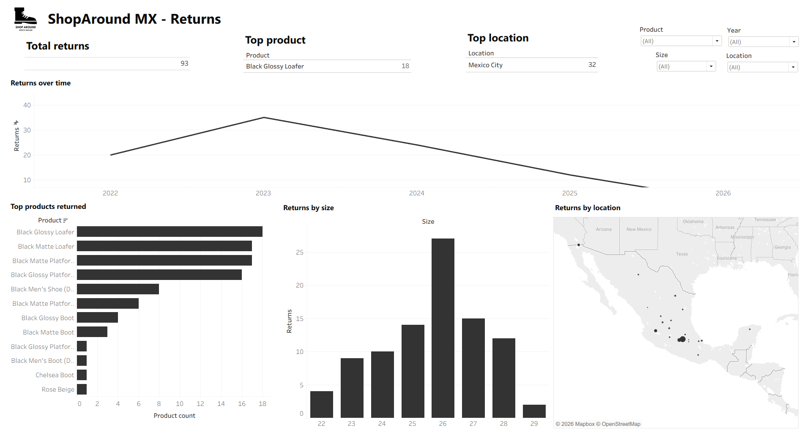

# ShopAround MX – Product Returns Dashboard

An interactive Tableau dashboard analyzing product return trends for **ShopAround MX**, an online footwear retailer. The dashboard tracks total returns, top returned products, return locations, and return patterns over time and by size, helping the business identify which products and sizes drive the most returns.

## 📊 Dashboard Preview

## 🔍 Overview

The dashboard answers key questions about product returns:

- **How many total returns** has the business received?
- **Which product** and **which location** generate the most returns?
- **How have returns changed over time** (by year)?
- **Which products** are returned most often?
- **Which sizes** have the highest return rates?
- **Where** (geographically) are returns concentrated?

It includes interactive filters for **Product**, **Size**, **Year**, and **Location**, allowing users to drill down into specific segments.

## 🗂️ Dataset

The dashboard is built from a returns dataset containing the following fields:

| Column | Description |
|---|---|
| Date | Date the return was recorded |
| Customer ID | Unique customer identifier |
| Product | Product name / style |
| Size | Shoe size returned |
| Location | City where the return occurred |
| Delivery Type | Sales/delivery channel (e.g. Mercado Libre) |

## 🛠️ Tools Used

- **Tableau** – dashboard design and data visualization
- **Excel** – source data storage

## 📈 Key Insights

- Returns peaked in **2023** and have trended downward through 2025–2026.
- **Black Glossy Loafer** is the most returned product.
- **Mexico City** accounts for the largest share of returns.
- Returns spike around **size 26**, suggesting a possible sizing/fit issue for that range.

