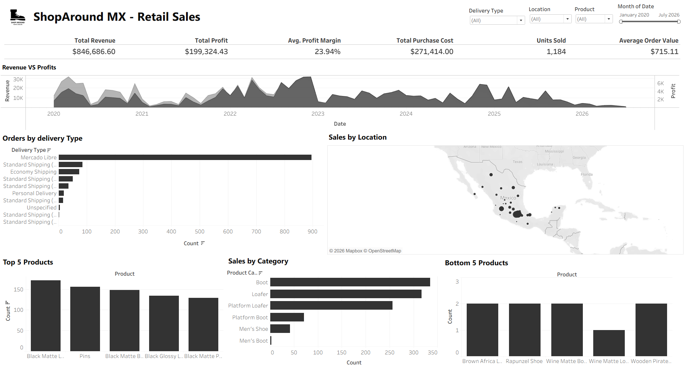

# 👟 ShopAround MX - Retail Sales Dashboard

An interactive Tableau dashboard analyzing retail sales performance for **ShopAround MX**, a footwear retailer operating through Mercado Libre and direct shipping channels in Mexico. The dashboard covers sales, profitability, delivery logistics, and product performance from **January 2020 to July 2026**.

## 📊 Dashboard Preview

## 🎯 Objective

Build a single-view executive dashboard that lets stakeholders quickly monitor:
- Overall revenue, profit, and order performance
- Revenue vs. profit trends over time
- Delivery method mix and geographic sales distribution
- Best and worst performing products and categories

## 🗂️ Data Sources

The dashboard was built from two datasets:

| Dataset | Description | Key Fields |
|---|---|---|
| `ShopAround_Sales_Master_Dataset.xlsx` | Transaction-level sales records | Date, Customer ID, Product, Product Category, Size, Location, Region Type, Delivery Type, Amount Received, Subtotal, Commissions, Taxes, Shipping Cost, Cost, Total Profit, Profit Margin |
| `ShopAround_Purchaising_Master_Dataset.xlsx` | Purchasing/inventory investment records | Order Date, Brand, Item Purchased, Units Purchased, Unit Price, Total Invested |

## 📈 Key Metrics (KPIs)

- **Total Revenue**
- **Total Profit**
- **Average Profit Margin**
- **Total Purchase Cost**
- **Units Sold**
- **Average Order Value**

## 🔍 Dashboard Sections

1. **Revenue vs. Profit** — Area chart tracking revenue and profit trends across the full date range.
2. **Orders by Delivery Type** — Bar chart breaking down order volume by shipping/delivery method.
3. **Sales by Location** — Geographic map showing sales concentration across Mexico.
4. **Top 5 & Bottom 5 Products** — Best and worst sellers by unit count.
5. **Sales by Category** — Product category performance (Boot, Loafer, Platform Loafer, etc.).

## 🎛️ Filters

- Delivery Type
- Location
- Product
- Month of Date (date range slider)

## 🛠️ Tools Used

- **Tableau Public/Desktop** — dashboard design and data visualization
- **Excel** — source data (sales and purchasing datasets)

